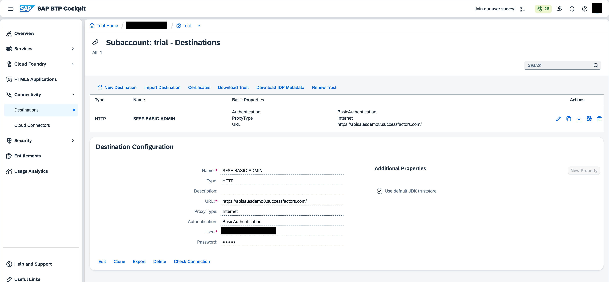
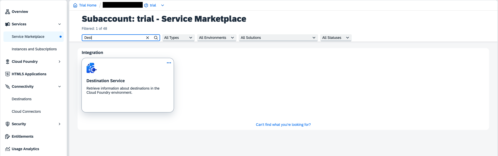
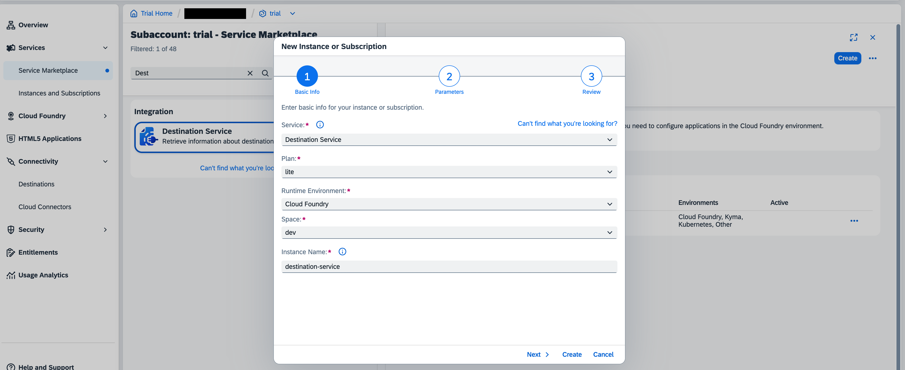
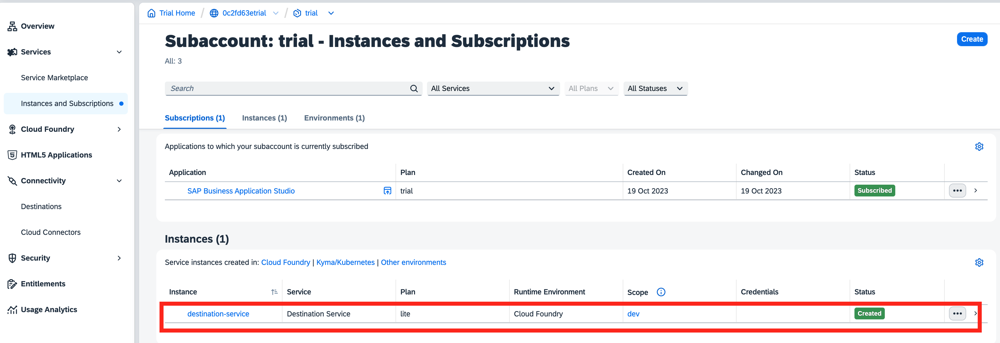
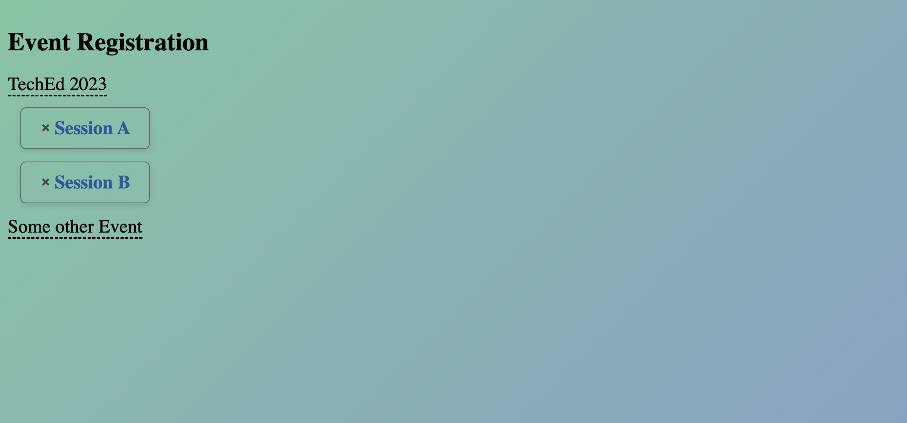

# Exercise 5 - (Optional) Deploying the application to SAP Business Technology Platform

In this exercise, we will look at the steps required to deploy the application to SAP Business Technology Platform.

## 5.1 Creating a destination for SuccessFactors API endpoint and the Synthetic OpenAPI service

- [ ] Please follow [this](https://developers.sap.com/tutorials/cp-cf-create-destination.html) tutorial to create a destination in your BTP Trial account cockpit with the following details:

   ```
   Name: SFSF-BASIC-ADMIN
   Type: HTTP
   Url: https://apisalesdemo8.successfactors.com/
   Proxy Type: Internet
   Authentication: BasicAuthentication
   User: <username-supplied-in-the-session>
   Password: <password-supplied-in-the-session>
   ```

   The resulting destination should look like this:
   

- [ ] Also, create a destination for the `Registration-Service` service with the following details:

   ```
   Name: Registration-Service
   Type: HTTP
   Url: https://ad266-registration.cfapps.eu10-004.hana.ondemand.com/
   Proxy Type: Internet
   Authentication: NoAuthentication
   ```

## 5.2 Creating a destination service instance

Navigate to the `Service Marketplace` in your BTP Trial account cockpit and find the `Destination` service and click on it.

   

- [ ] Click on `Create` to create a new instance of the service. Enter an `Instance Name` of your choice, everything else can be left as default. Click on `Create` to create the instance.

   

The created instance will be listed in the `Instances and Subscriptions` tab.

  


## 5.3 Adjusting the deployment descriptor - manifest.yml

- [ ] Open the [`manifest.yml`](../../manifest.yml) file and edit the following lines and save the changes:

   ```diff
   -#  services:
   -#    - destination-service
   +  services:
   +    - <your-destination-service-instance-name>
   ```

## 5.4 Deploy the application and Test

We will use `CF CLI` to deploy the application.

- [ ] Login into your BTP Trial account CF space by using the following command in your IDE's terminal:

   ```shell
   cf login -a API-URL -u USERNAME -p PASSWORD
   ```
   where `API-URL` is the API endpoint of your BTP Trial account, you can see it in the Overview page and `USERNAME` and `PASSWORD` are the credentials you use to log in to your BTP Trial account cockpit.

- [ ] Navigate to the project's [root folder](../../) (`teched2023-AD266`)
   1. Run `mvn package` from the root folder to build your project.
   2. Once, the build finishes successfully, run `cf push` to deploy the application to your BTP Trial account.
   3. The url of the deployed application will be displayed in your terminal under `routes` section.

- [ ] Once the application is deployed successfully, you can test the application by navigating to the <your-application-url> in your browser.
   You should see a screen like this:
      

You can test the application out now by clicking on the buttons available.

- [ ] To see the goals created in SuccessFactors, log in to [SuccessFactors](https://pmsalesdemo8.successfactors.com/) with USER and PASSWORD provided and check if the goal with your chosen <DEMO_ID> (defined in [`Helper`](../../srv/src/main/java/com/sap/cloud/sdk/demo/ad266/utility/Helper.java)) and sub-goal have been created for the user.

## Summary

You've now successfully deployed your application to BTP CF and tested it.

Continue to - [Share your feedback](https://github.com/SAP-samples/teched2023-AD266/issues/new/choose)
